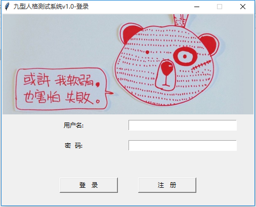
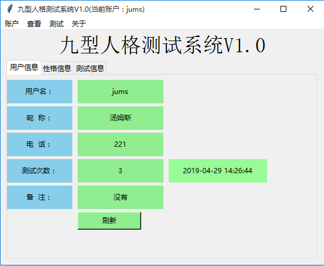
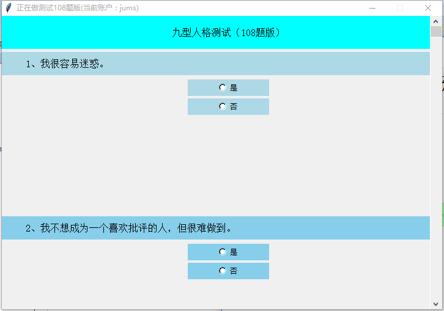
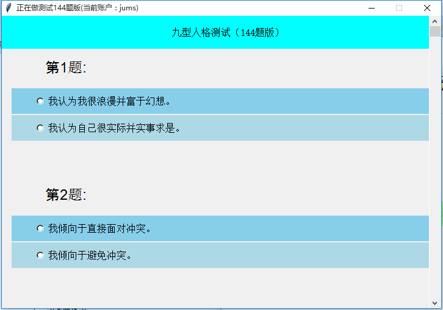
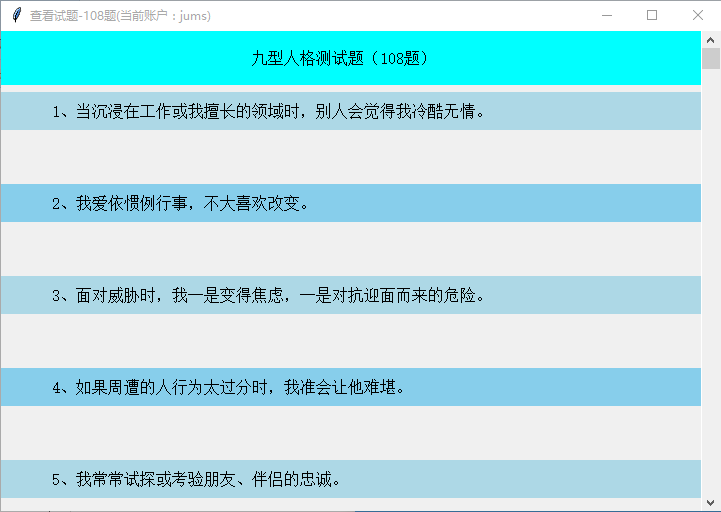
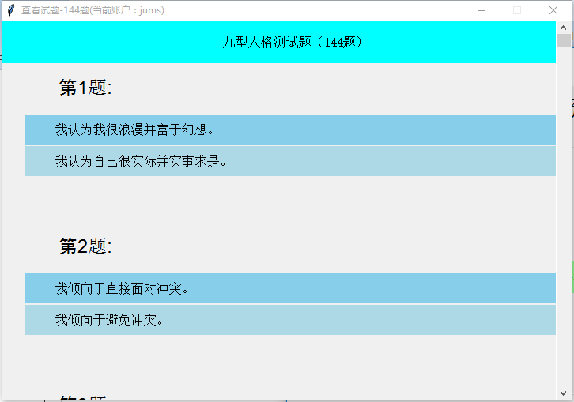
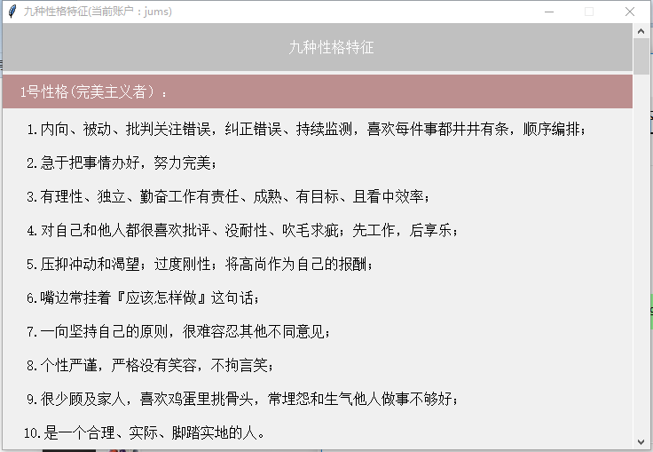
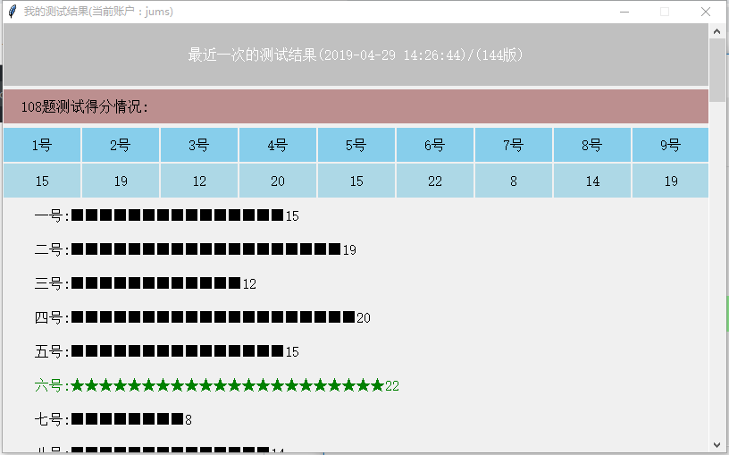
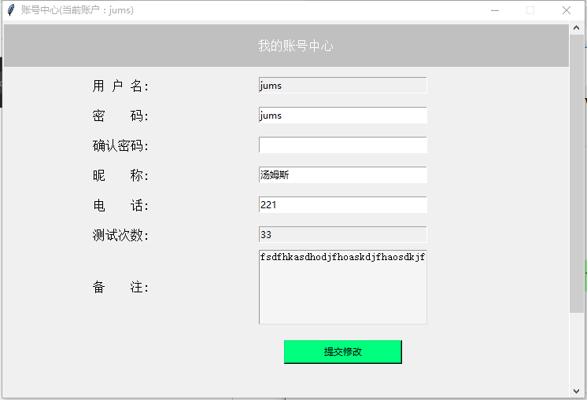

# 简介
这是一个基于`Python`语言编写的一个小程序，是一个九型人格的测试系统，理论知识基于《九型人格》--海伦.帕尔默编写
# 程序入口
`login.py` 这是程序的入口，用户注册账号并进行登录，登录完成之后就可以进行九型人格的测试

# 数据库
本程序使用的`MySQL`数据库，由于免费以及轻量级的原因，`sql`文件放在`sql`文件夹中，用户建立好数据库就直接运行该`sql`文件即可，`MySQL`的用户名和密码本程序设置的都是`root`
# 可执行文件
本程序将所有代码进行了一个封装，将其封装成了一个可执行的EXE文件，放在dist文件夹中
# 需要改进的地方
本程序还有一些小地方没有完善，但是基本的测试功能可以实现，所以不会影响正常的测试使用，如果您想基于本程序做一个改善，非常欢迎，也可以与本人去的联系，可以加我的微信：`crazyjumsz`
# 程序演示
## 登录界面

## 注册界面

## 主界面

## 测试界面
* ### 108题测试

* ### 144题测试

## 查看试题界面
* ### 查看108题界面

* ### 查看144题界面

## 关于作者

## 查看九型人格性格特征

## 查看测试结果

## 查看个人中心

